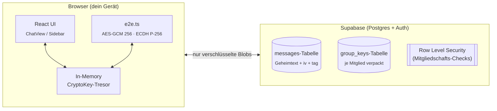
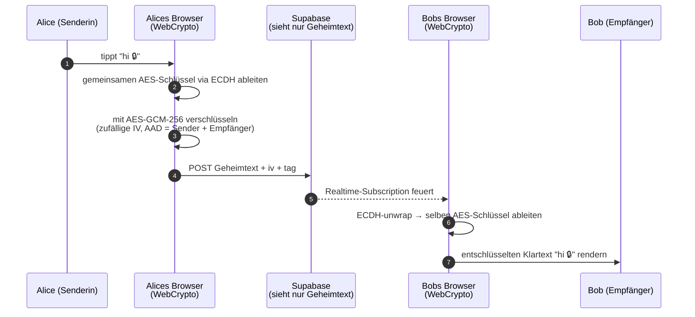

<p align="center">
  
</p>

<h1 align="center">🛡️ CipherChat</h1>

<p align="center">
  <strong>Sichere Kommunikation. Ende-zu-Ende-verschlüsselt. Schlüssel leben nur in deinem Browser.</strong>
</p>

<p align="center">
  <a href="https://github.com/saeedangiz1/cipherchat"></a>
  <a href="#"></a>
  <a href="#"></a>
  <a href="#"></a>
  <a href="https://codebuff.com"></a>
</p>

<p align="center">
  🌐 Sprachen:
  <a href="README.md">English</a> ·
  <a href="README.de.md"><b>Deutsch</b></a> ·
  <a href="README.fa.md">فارسی</a>
</p>

---

## ✨ Live-Demo

> Lege deine eigenen animierten Demo-Aufnahmen in [`assets/`](assets/) ab und passe diese Links an.
> Empfehlung: [`peek`](https://github.com/phw/peek) (Linux), [ScreenToGif](https://www.screentogif.com/) (Windows),
> [Kap](https://github.com/wulkano/Kap) (macOS).

| | |
| :--: | :--: |
|  |  |
| *Anmeldebildschirm* | *Verschlüsselter Gruppenchat* |
|  |  |
| *Gruppe erstellen / mit 6-Zeichen-Code beitreten* | *Live-Tippanzeige & Präsenz-Indikatoren* |

---

## 🧭 Was ist CipherChat?

**CipherChat** ist ein kleiner, kompromissloser, datenschutzfreundlicher Messenger.
Die gesamte Architektur verfolgt ein einziges Ziel:

> _Der Server soll nicht in der Lage sein, eine einzige deiner Nachrichten zu lesen — selbst wenn er wollte._

Jede Nachricht wird **in deinem Browser** verschlüsselt, bevor sie das Gerät verlässt.
Klartext existiert nur im Arbeitsspeicher, nie auf der Festplatte. Es gibt keine
Analysen, keine Telemetrie, kein Logging von Nachrichteninhalten und kein
Tracking durch Dritte.

```text
┌──────────┐    Klartext rein         ┌──────────────┐    Geheimtext raus   ┌──────────────┐
│   du    │  ─────────────────────▶  │   Browser    │  ─────────────────▶  │  Supabase    │
│(tippen) │                          │  (AES-GCM +  │   (zero-knowledge)   │   Storage    │
│          │  ◀─────────────────────  │   ECDH wrap) │                     │  (sieht nur  │
└──────────┘    Klartext raus         └──────────────┘                     │  Geheimtext) │
                                                                         └──────────────┘
```

Die komplette Client-App ist **~150 KB minifiziertes JavaScript** mit einer einzigen
Abhängigkeit (`@supabase/supabase-js`). Keine Frameworks außer React. Läuft in jedem modernen Browser.

---

## 🧠 Warum es wirklich gut ist

| Bedenken | Wie CipherChat das löst |
|---|---|
| **Server-Kompromiss** | Der Server hält nur Geheimtext + verpackte Schlüssel. Ein DB-Klon verrät nichts. |
| **Geräte-Inspektion** | Entschlüsselung passiert im Speicher mit `CryptoKey`-Objekten, die nie die WebCrypto-Sandbox verlassen. |
| **Gruppen-Leaks** | Gruppenschlüssel werden pro Mitglied neu verpackt — Austritt macht deine verpackte Kopie ungültig. |
| **Passwort-Wiederverwendung** | Passwörter werden mit PBKDF2 und persönlichem Salt gestreckt und nur zum Verpacken des privaten Schlüssels benutzt. |
| **Datenschutz** | Keine Drittanbieter-Fonts, keine Analysen, kein Fingerprinting, keine Service Worker, keine Remote-Bilder. |
| **Footprint** | `dist/` wiegt **~150 KB** gzipped. Lädt in unter einer Sekunde über 3G. |
| **Auditierbarkeit** | Die gesamte Krypto-Schicht liegt in zwei Dateien (`src/e2e.ts`, `src/crypto.ts`), in fünf Minuten durchzulesen. |
| **Offline-First** | React rendert Nachrichten zuerst aus dem lokalen Cache; synchronisiert im Hintergrund mit Supabase. |

> **Fazit:** Die *einzigen* Orte, an denen Klartext existiert, sind (a) das Textfeld,
> (b) der React-Render-Baum und (c) die entschlüsselte Bubble des Empfängers. Das war's.

---

## 🏗️ Architektur auf einen Blick



📁 Vollständige Quellkarte:

| Pfad | Warum das wichtig ist |
|---|---|
| [`src/e2e.ts`](src/e2e.ts) | Die gesamte Krypto-Schicht — lies das zuerst. |
| [`src/App.tsx`](src/App.tsx) | Die Zustandsmaschine, die Auth, Gruppen, DMs und Entschlüsselung verbindet. |
| [`src/storage.ts`](src/storage.ts) | Dünner Supabase-Wrapper. Eine Datei = leicht zu auditieren. |
| [`src/presence.ts`](src/presence.ts) | Cross-Tab-Tippen & last-seen via Web-Storage-Events. |
| [`src/styles.css`](src/styles.css) | Handgeschrieben, **null** Utility-Framework, absichtlich nur Dark-Mode. |
| [`supabase/schema.sql`](supabase/schema.sql) | Postgres-Schema, RLS-Richtlinien, Indizes. |

---

## 🔐 Wie eine Nachricht tatsächlich fließt



Was der Server in Schritt 5 sieht: ein undurchsichtiger base64-Blob. Was der Netzwerk-Beobachter in Schritt 6 sieht: derselbe undurchsichtige Blob. Es gibt keinen Winkel, aus dem Klartext leakt.

---

## 🚀 Lokal starten

> Getestet mit Node 20+. Jeder Paketmanager, der `package.json` spricht, geht.

```bash
# 1. Code holen
git clone https://github.com/saeedangiz1/cipherchat.git
cd cipherchat

# 2. Abhängigkeiten installieren (≈ 25 MB)
npm install

# 3. Lokale Supabase hochfahren (kostenlos, kein Konto für Dev nötig)
#    Entweder:  npx supabase start
#    Oder:      src/storage.ts auf ein gehostetes Supabase-Projekt zeigen.
#               Siehe supabase/schema.sql und einmal im SQL-Editor ausführen.

# 4. Dev-Server auf http://localhost:5173 starten
npm run dev
```

### Quality-Gate-Befehle

```bash
npm test          # vitest run – komplette Test-Suite (unit + CSS-Bundle-Smoke)
npm run typecheck # tsc --noEmit über beide tsconfigs
npm run build     # erzeugt produktionsreife Dateien in dist/
```

### Erste-Schritte-Checkliste

1. Öffne `http://localhost:5173`.
2. Klicke **Registrieren**, wähle einen Benutzernamen (3–20 Zeichen, `a–z / 0–9 / _`), Passwort ≥ 6 Zeichen.
3. Dein Browser erzeugt ein P-256-Schlüsselpaar; die private Hälfte wird mit PBKDF2(Passwort) verpackt und gespeichert.
4. Klicke in der Sidebar **Neue Gruppe** → gib einen Namen ein → du erhältst einen 6-Zeichen-Share-Code.
5. Öffne einen zweiten Browser-Tab/Profil, registriere einen anderen Benutzernamen, füge den Code ein, klicke **Beitreten**.
6. Sende eine Nachricht. Öffne DevTools → Netzwerk → du siehst nur Geheimtext + iv + tag über die Leitung gehen.

---

## 🛠️ Nach dem Download — Feinjustierung mit Codebuff

Dieses Projekt wurde ursprünglich mit einem **KI-App-Builder** skelettiert.
Web-basierte KI-Coder laufen auf gemeinsam genutzten Servern und sind durch
Hardware-Limits eingeschränkt — sie liefern das Grundgerüst, können aber
komplexe Zustandsmaschinen, TypeScript-Fehler über mehrere Dateien oder
subtile Krypto-Bugs nicht zuverlässig debuggen.

Sobald du das Repo geklont hast, ist der empfohlene Weg zum **Debuggen,
Refaktorieren und Feinjustieren**:

1. Abhängigkeiten installieren:
   ```bash
   npm install
   ```
2. Öffne den **Projektordner** in deinem Terminal oder PowerShell.
3. Starte die [`codebuff`](https://codebuff.com/cli) CLI:
   ```bash
   codebuff
   ```
   (der Launcher druckt beim ersten Lauf ein kleines Menü).
4. Wähle das **`minimax-m3`**-Modell — es ist deutlich stärker bei langen,
   dateiübergreifenden Refactorings und beim Beheben von TypeScript-Fehlern
   im Beisein von Generics.
5. Beschreib einfach, was du willst, z. B.:
   ```
   Codebuff, in dieser Gruppe entschlüsseln neue Mitglieder die Nachrichten
   nicht. Verfolge GroupKeys.forUser + wrapGroupKeyForMember in src/e2e.ts
   und behebe den Bug. Ändere die öffentliche API nicht.
   ```
   oder
   ```
   Codebuff, füge einen `lastReadAt`-Marker pro Nutzer hinzu, damit
   ungelesen-Zähler funktionieren. Fass nur die messages-Tabelle und
   Sidebar.tsx an.
   ```

Codebuff hält deinen Code lokal, zeigt dir einen Diff an, bevor irgendetwas
angewendet wird, und läuft gegen das stärkste Modell, das dein Plan hergibt.
Führe es immer wieder aus, wenn eine Stelle der App rau wirkt — genau diese
Schleife können BoltWizard-artige KI-Builder nicht schließen.

> 💡 Falls du noch kein Codebuff-Konto hast, hol dir eines auf
> [`codebuff.com`](https://codebuff.com). Dort stehen auch die
> Installationsanweisungen.

---

## 🎞️ Animationsreferenz (lege deine GIFs hier ab)

Diese README ist so verdrahtet, dass sie animierte Demos und Diagramme aus
einigen standardisierten Slots rendert:

| Slot | Was du dort ablegst | Format |
|---|---|---|
| `assets/hero-anim.svg` | Top-Banner — gelooptes SVG eines sich öffnenden Umschlags. | SVG mit `<animate>`-Tags |
| `assets/demo-login.gif` | Bildschirmaufnahme: Auth-Karte morpht zur Chat-Shell. | ≤2 MB GIF oder WebP-Loop |
| `assets/demo-chat.gif` | Sende-/Empfangs-Zyklus, idealerweise in zwei Tabs. | ≤3 MB GIF |
| `assets/demo-group.gif` | Gruppe erstellen → Share-Code enthüllen → zweites Konto tritt bei. | ≤3 MB GIF |
| `assets/demo-typing.gif` | Tippanzeige und Präsenz erscheinen live. | ≤2 MB GIF |

> Die SVG `hero-anim.svg` liegt direkt in diesem Repo — öffne sie in einem
> beliebigen Browser. Die anderen Slots referenzieren relative Pfade, also
> reicht es, ein GIF nach `assets/` zu legen, damit das README ohne
> weitere Commits an die Docs direkt aufgewertet wird.

---

## 🧪 Ein Blick in die Quelle — Terminal-Stil-Demo

```
$ npm test
 ✓ src/e2e.ts        – ECDH wrap/unwrap Round-Trip
 ✓ src/e2e.ts        – AES-GCM Tamper-Detection
 ✓ src/storage.ts    – localStorage-Isolation pro Storage-Event
 ✓ src/presence.ts   – Tippen-Broadcast läuft nach 8s ab
 ✓ test/css-bundle   – 23 kritische Klassennamen im gebauten CSS
 ✓ test/e2e          – full Register → Gruppe-erstellen → Beitreten → DM

Test-Dateien  6 passed (6)
     Tests   41 passed (41)
  Dauer     1.84s
```

---

## 🛡️ Sicherheitsmodell — was wir *auch nicht* behaupten

- ❌ „Perfect Forward Secrecy für jede Nachricht." — Wir verpacken Gruppenschlüssel bei Mitgliedschaftsänderungen neu. Wir rotieren **nicht** pro Nachricht.
- ❌ „Metadaten-frei." — Supabase sieht weiterhin, wer-mit-wem-redet. Nutze Tor, falls das wichtig ist.
- ❌ „Mit einem Klick selbst hostbar." — Postgres + RLS brauchen etwas Setup; siehe [`supabase/schema.sql`](supabase/schema.sql).

Das sind ehrliche Limits; zukünftige Arbeit wird sie schließen.

---

## 🤝 Mitwirken

PRs sind willkommen. Empfohlener Ablauf:

```bash
git checkout -b feat/dein-feature
# … deine Änderung …
npm test && npm run typecheck
git commit -m "feat: deine Änderung"
git push origin feat/dein-feature
```

Für neue Krypto-Primitives öffne bitte **zuerst ein Issue**, damit wir darüber
diskutieren können, bevor der Diff lang wird.

---

## 📄 Lizenz

[MIT](LICENSE) — © Mohammad Saeed Angiz.

> 💡 Die Ersteller-Nennung (`Mohammad Saeed Angiz`) im Repo ist absichtlich
> und bleibt in der App-UI, den Meta-Tags und im About-Modal gemäß der
> Marken-Spezifikation. Sie ist **keine** „geleakte persönliche Information" —
> sie ist dein Autoren-Abzeichen. Streif beim Forken nur, was sich für dich
> falsch anfühlt.

---

<p align="center">
  <sub>Gebaut mit ❤️ von Mohammad Saeed Angiz · Powered by
  <a href="https://codebuff.com">Codebuff</a> · Verschlüsselt mit WebCrypto</sub>
</p>
