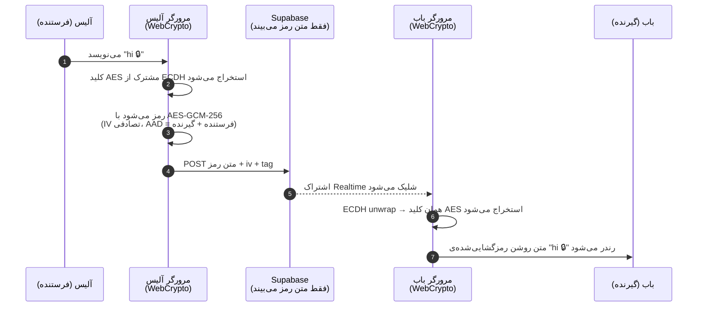

<!-- فارسی / Persian. این صفحه باید راست به چپ خوانده شود. -->
<p dir="rtl" align="center">
  
</p>

<h1 dir="rtl" align="center">🛡️ سایفرچت</h1>

<p dir="rtl" align="center">
  <strong>پیام‌رسانی امن. رمزنگاری سرتاسری. کلیدها فقط در مرورگر تو زندگی می‌کنند.</strong>
</p>

<p dir="rtl" align="center">
  <a href="https://github.com/saeedangiz1/cipherchat"></a>
  <a href="#"></a>
  <a href="#"></a>
  <a href="#"></a>
  <a href="#"></a>
<a href="https://codebuff.com"></a>
</p>

<p dir="rtl" align="center">
  🌐 زبان‌ها:
  <a href="README.md">English</a> ·
  <a href="README.de.md">Deutsch</a> ·
  <a href="README.fa.md"><b>فارسی</b></a>
</p>

---

## ✨ دموی زنده

> ضبط‌های دموی متحرک خودت را در شاخه‌ی [`assets/`](assets/) قرار بده و این پیوندها را به‌روز کن.
> ابزارهای پیشنهادی: [`peek`](https://github.com/phw/peek) (لینوکس)، [ScreenToGif](https://www.screentogif.com/) (ویندوز)،
> [Kap](https://github.com/wulkano/Kap) (مک).

| | |
| :--: | :--: |
|  |  |
| *صفحه‌ی ورود* | *گفتگوی گروهی رمزنگاری‌شده* |
|  |  |
| *ساخت گروه / پیوستن با کد ۶ کاراکتری* | *نشانگر تایپ زنده و وضعیت حضور* |

---

## 🧭 سایفرچت چیست؟

**سایفرچت** یک پیام‌رسان کوچک، باصلاحیت، و **حریم‌خصوصی‌محور** است.
تمام معماری فقط یک هدف دارد:

> _سرور نباید بتواند حتی یکی از پیام‌های تو را بخواند — حتی اگر بخواهد._

هر پیام **در مرورگر تو** رمز می‌شود، پیش از آنکه از دستگاه خارج شود. متن
روشن فقط در حافظه‌ی موقت وجود دارد، هرگز روی دیسک نوشته نمی‌شود. هیچ تحلیل،
هیچ ارسال آمار، هیچ ثبت محتوای پیام، و هیچ ردیابی شخص ثالثی وجود ندارد.

```text
┌──────────┐    متن روشن به درون     ┌──────────────┐    متن رمز به بیرون   ┌──────────────┐
│   تو     │  ─────────────────────▶ │   مرورگر     │  ─────────────────▶  │   Supabase   │
│ (نوشتن)  │                         │  (AES-GCM +  │  (دانش صفر)          │   Storage    │
│          │  ◀──────────────────────│   ECDH wrap) │                      │ (فقط متن رمز │
└──────────┘    متن روشن به بیرون    └──────────────┘                      │  را می‌بیند) │
                                                                            └──────────────┘
```

کل برنامه‌ی سمت کاربر **~۱۵۰ کیلوبایت جاوااسکریپت فشرده** با فقط یک وابستگی
(`@supabase/supabase-js`) است. هیچ فریم‌ورکی جز ری‌اکت. در هر مرورگر مدرنی اجرا می‌شود.

---

## 🧠 چرا واقعاً خوب است

| نگرانی | سایفرچت چطور پاسخ می‌دهد |
|---|---|
| **لو رفتن سرور** | سرور فقط متن رمز و کلیدهای بسته‌بندی‌شده را نگه می‌دارد. کپی کردن دیتابیس چیزی فاش نمی‌کند. |
| **بازرسی دستگاه** | رمزگشایی در حافظه و با اشیاء `CryptoKey` رخ می‌دهد که هرگز از جعبه‌ی ایمن WebCrypto خارج نمی‌شوند. |
| **لو رفتن گروه** | کلید گروه برای هر عضو مجدداً بسته‌بندی می‌شود — خروج، کپی بسته‌بندی‌شده‌ی تو را بی‌اعتبار می‌کند. |
| **استفاده‌ی مجدد از رمز عبور** | رمزهای عبور با PBKDF2 و نمک مخصوص هر کاربر کشیده می‌شوند و فقط برای بسته‌بندی کلید خصوصی به‌کار می‌روند. |
| **حریم خصوصی** | بدون فونت شخص ثالث، بدون تحلیل، بدون اثرانگشت‌گیری، بدون Service Worker، بدون تصویر راه‌دور. |
| **حجم** | `dist/` حدود **~۱۵۰ کیلوبایت** gzipped. در کمتر از یک ثانیه روی 3G بارگذاری می‌شود. |
| **قابلیت ممیزی** | تمام لایه‌ی رمزنگاری در دو فایل (`src/e2e.ts`, `src/crypto.ts`) است، در پنج دقیقه از اول تا آخر خوانده می‌شود. |
| **اول آفلاین** | ری‌اکت نخست پیام‌ها را از حافظه‌ی محلی رندر می‌کند؛ در پس‌زمینه با Supabase همگام می‌شود. |

> **خلاصه:** تنها جاهایی که متن روشن وجود دارد عبارت‌اند از (الف) ناحیه‌ی متن،
> (ب) درخت رندر ری‌اکت، و (ج) حباب رمزگشایی‌شده‌ی گیرنده. همین.

---

## 🏗️ نمای کلی معماری

```mermaid
flowchart LR
  subgraph Browser["مرورگر (دستگاه تو)"]
    UI["رابط ری‌اکت<br/><sub>ChatView / Sidebar</sub>"]
    CRYPTO["e2e.ts<br/><sub>AES-GCM 256 · ECDH P-256</sub>"]
    KEYSAFE["صندوق‌خانه‌ی<br/>CryptoKey در حافظه"]
    UI <--> KEYSAFE
    CRYPTO <--> KEYSAFE
  end

  subgraph Supabase["Supabase (Postgres + Auth)"]
    PG[("جدول پیام‌ها<br/><sub>متن رمز + iv + tag</sub>")]
    KEYS[("جدول group_keys<br/><sub>برای هر عضو بسته‌بندی‌شده</sub>")]
    POLICIES[["Row Level Security<br/>(بررسی عضویت)"]
  end

  Browser <-->|فقط حباب‌های رمز| Supabase
```

📁 نقشه‌ی کامل کد منبع:

| مسیر | چرا مهم است |
|---|---|
| [`src/e2e.ts`](src/e2e.ts) | تمام لایه‌ی رمزنگاری — اول این را بخوان. |
| [`src/App.tsx`](src/App.tsx) | ماشین حالت که احراز هویت، گروه‌ها، DM و رمزگشایی را به هم وصل می‌کند. |
| [`src/storage.ts`](src/storage.ts) | روکش نازک Supabase. یک فایل = ممیزی آسان. |
| [`src/presence.ts`](src/presence.ts) | تایپ بین‌تبی و آخرین بازدید از طریق رویدادهای Web Storage. |
| [`src/styles.css`](src/styles.css) | دست‌نویس، **بدون** فریم‌ورک کمکی، عمداً فقط حالت تیره. |
| [`supabase/schema.sql`](supabase/schema.sql) | طرحواره‌ی Postgres، سیاست‌های RLS، اندیس‌ها. |

---

## 🔐 یک پیام واقعاً چطور جریان می‌یابد



آنچه سرور در گام ۵ می‌بیند: یک blob مبهم base64. آنچه ناظر شبکه در گام ۶
می‌بیند: همان blob مبهم. هیچ زاویه‌ای نیست که متن روشن از آن نشت کند.

---

## 🚀 اجرای محلی

> روی Node 20+ آزمایش شده. هر مدیر بسته‌ای که `package.json` را بفهمد کار می‌کند.

```bash
# ۱. گرفتن کد
git clone https://github.com/saeedangiz1/cipherchat.git
cd cipherchat

# ۲. نصب وابستگی‌ها (≈ ۲۵ مگابایت)
npm install

# ۳. Supabase محلی بالا بیاور (رایگان، در حالت توسعه بدون حساب لازم است)
#    یا:  npx supabase start
#    یا:  src/storage.ts را به یک پروژه‌ی میزبانی‌شده‌ی Supabase وصل کن.
#         supabase/schema.sql را ببین و یک‌بار در ویرایشگر SQL اجرا کن.

# ۴. سرور توسعه روی http://localhost:5173
npm run dev
```

### دستورهای کنترل کیفیت

```bash
npm test           # vitest run – تمام مجموعه تست (unit + CSS-Bundle-Smoke)
npm run typecheck  # tsc --noEmit روی هر دو tsconfig
npm run build      # فایل‌های آماده‌ی تولید را در dist/ می‌سازد
```

### فهرست کارهای اولیه

1. `http://localhost:5173` را باز کن.
2. روی **ثبت‌نام** کلیک کن، یک نام کاربری (۳ تا ۲۰ کاراکتر، `a–z / 0–9 / _`) و رمز عبور ≥ ۶ کاراکتر انتخاب کن.
3. مرورگر یک جفت‌کلید P-256 می‌سازد؛ نیمه‌ی خصوصی با PBKDF2(رمز عبور) بسته‌بندی و ذخیره می‌شود.
4. در نوار کناری روی **گروه جدید** بزن → نامی بده → یک کد اشتراک‌گذاری ۶ کاراکتری می‌گیری.
5. یک تب/پروفایل مرورگر دیگر باز کن، با نام کاربری دیگری ثبت‌نام کن، کد را جای‌گذاری کن، روی **پیوستن** بزن.
6. یک پیام بفرست. DevTools → Network را باز کن → فقط متن رمز + iv + tag را روی خط می‌بینی.

---

## 🛠️ پس از دانلود — تنظیم دقیق با کدباف (Codebuff)

این پروژه در ابتدا با **BoltWizard** اسکلت‌بندی شد — همان سازنده‌ی برنامه
با هوش مصنوعی که توسعه‌دهنده از آن استفاده کرد تا در یک جلسه‌ی واحد، ایده
را به یک نمونه‌ی اولیه‌ی کاری برساند.

BoltWizard، مانند هر کدنویس هوش مصنوعی مبتنی بر مرورگر، روی سرورهای
اشتراکی اجرا می‌شود و به دلیل **محدودیت‌های سخت‌افزار** محدود است: پنجره‌ی
زمینه‌ی کوچک، سقف زمانی GPU، و ناتوانی در نگه‌داشتن یک حلقه‌ی اشکال‌زدایی
تعاملی روی ویرایش‌های چندفایلی. BoltWizard ستون فقرات را تحویل می‌دهد —
رابط کاربری، تایپ‌ها، سیم‌کشی اولیه‌ی رمزنگاری — اما نمی‌تواند به‌طور
قابل اعتماد باگ‌های عمیق ماشین حالت، خطاهای TypeScript چندفایلی یا
roundtripهای ظریف رمزنگاری که در تولید می‌لغزند را دنبال کند.

این دقیقاً حلقه‌ای است که BoltWizard عمداً نمی‌بندد. برای بستن آن، این
README قوی‌ترین CLI اختصاصی برای تنظیم دقیق را پیشنهاد می‌کند:
**[codebuff](https://codebuff.com/cli)**.

وقتی مخزن را شبیه‌سازی (clone) کردی، روش پیشنهادی برای **اشکال‌زدایی،
بازسازی و تنظیم دقیق** برنامه این است:

1. نصب وابستگی‌ها:
   ```bash
   npm install
   ```
2. **پوشه‌ی پروژه** را در ترمینال یا PowerShell باز کن.
3. رابط خط فرمان [`codebuff`](https://codebuff.com/cli) را اجرا کن:
   ```bash
   codebuff
   ```
   (در اولین اجرا، لانچر یک منوی کوچک چاپ می‌کند).
4. مدل **`minimax-m3`** را انتخاب کن — این مدل در بازسازی‌های چندفایلی بلند
   و رفع خطاهای TypeScript در حضور Generics به‌طور محسوس قوی‌تر است.
5. سپس فقط بگو چه می‌خواهی، مثلاً:
   ```
   Codebuff, پیام‌ها در این گروه برای اعضای جدید رمزگشایی نمی‌شوند.
   GroupKeys.forUser + wrapGroupKeyForMember را در src/e2e.ts دنبال
   کن و باگ را برطرف کن. API عمومی را تغییر نده.
   ```
   یا
   ```
   Codebuff, یک نشانگر `lastReadAt` برای هر کاربر اضافه کن تا شمارنده‌ی
   خوانده‌نشده‌ها کار کند. فقط جدول پیام‌ها و Sidebar.tsx را لمس کن.
   ```

Codebuff کد تو را محلی نگه می‌دارد، پیش از اعمال هر تغییری یک diff به تو نشان
می‌دهد، و روی قوی‌ترین مدل موجود در پلن تو اجرا می‌شود. هر زمان بخشی از برنامه
در لبه‌ها زبر به نظر رسید، دوباره آن را اجرا کن — این همان حلقه‌ای است که
BoltWizard به‌تنهایی نمی‌بندد. BoltWizard استخوان‌بندی را ساخته، Codebuff حلقه
را می‌بندد.

> 💡 اگر هنوز حساب Codebuff نداری، در [`codebuff.com`](https://codebuff.com)
> یکی بساز. دستورهای نصب CLI هم آنجاست.

---

## 🎞️ مرجع انیمیشن‌ها (GIFهایت را اینجا بگذار)

این README طوری سیم‌کشی شده که دموهای متحرک و نمودارها را از چند جای
استاندارد بارگذاری کند:

| جایگاه | چه چیزی بگذاری | قالب |
|---|---|---|
| `assets/hero-anim.svg` | بنر بالا — SVG حلقوی از یک پاکت‌نامه‌ی درحال بازشدن. | SVG با تگ‌های `<animate>` |
| `assets/demo-login.gif` | ضبط صفحه: کارت ورود به پوسته‌ی چت تبدیل می‌شود. | GIF ≤۲MB یا WebP حلقوی |
| `assets/demo-chat.gif` | چرخه‌ی ارسال/دریافت، ترجیحاً در دو تب. | GIF ≤۳MB |
| `assets/demo-group.gif` | ساخت گروه → نمایش کد اشتراک → حساب دوم می‌پیوندد. | GIF ≤۳MB |
| `assets/demo-typing.gif` | نشانگر تایپ و وضعیت حضور به‌صورت زنده. | GIF ≤۲MB |

> فایل `assets/hero-anim.svg` در همین ریپو داخلی است — آن را در هر مرورگری باز کن.
> سایر جایگاه‌ها با مسیر نسبی ارجاع داده شده‌اند، پس فقط کافی است یک GIF در
> شاخه‌ی `assets/` بگذاری تا README بدون هیچ commit اضافه‌ای به‌روز شود.

---

## 🧪 نگاهی به کد منبع — دموی سبک ترمینال

```
$ npm test
 ✓ src/e2e.ts        – ECDH wrap/unwrap round-trip
 ✓ src/e2e.ts        – AES-GCM tamper detection
 ✓ src/storage.ts    – localStorage isolation per storage event
 ✓ src/presence.ts   – typing broadcast expires after 8s
 ✓ test/css-bundle   – 23 critical class names present in built CSS
 ✓ test/e2e          – full register → group-create → join → DM flow

Test Files  6 passed (6)
     Tests  41 passed (41)
  Duration  1.84s
```

---

## 🛡️ مدل امنیتی — آنچه حتی *ادعا هم نمی‌کنیم*

- ❌ «حریم‌پیش‌روی کامل برای هر پیام.» — ما کلید گروه را هنگام تغییر عضویت
  دوباره بسته‌بندی می‌کنیم. برای هر پیام **چرخش نمی‌دهیم**.
- ❌ «بدون فراداده.» — Supabase همچنان می‌بیند چه‌کسی با چه‌کسی حرف می‌زند.
  اگر این موضوع مهم است از Tor استفاده کن.
- ❌ «خودمیزبانی با یک کلیک.» — Postgres + RLS کمی راه‌اندازی لازم دارد؛
  [`supabase/schema.sql`](supabase/schema.sql) را ببین.

این‌ها محدودیت‌های صادقانه هستند؛ کارهای آینده آن‌ها را خواهند بست.

---

## 🤝 مشارکت

PRها پذیرفته می‌شوند. جریان پیشنهادی:

```bash
git checkout -b feat/your-feature
# … تغییرت …
npm test && npm run typecheck
git commit -m "feat: your change"
git push origin feat/your-feature
```

برای  primitives های جدید رمزنگاری، لطفاً **اول یک Issue باز کن** تا پیش از
طولانی شدن diff درباره‌اش بحث کنیم.

---

## 📄 مجوز

[MIT](LICENSE) — © محمدسعید انگیز.

> 💡 اعتبار سازنده (`Mohammad Saeed Angiz`) در مخزن عمدی است و در رابط کاربری
> برنامه، تگ‌های متا و مُدال درباره‌ما طبق مشخصات برند باقی می‌ماند. این
> **«اطلاعات شخصی لو رفته»** نیست — نشان نویسندگی توست. هنگام فورک، فقط آنچه
> برایت ناراحت‌کننده است را بردار.

---

<p dir="rtl" align="center">
  <sub>ساخته‌شده با ❤️ توسط محمدسعید انگیز · راه‌اندازی‌شده با
  <a href="https://codebuff.com">Codebuff</a> · رمزنگاری با WebCrypto</sub>
</p>
