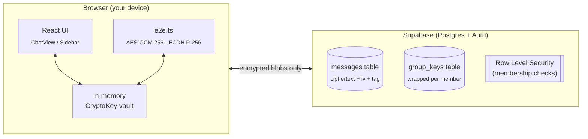
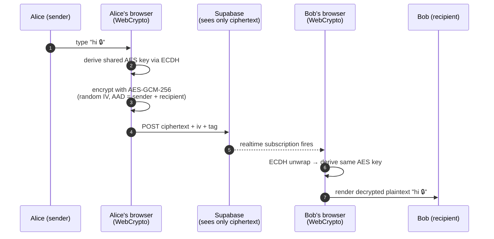

<p align="center">
  
</p>

<h1 align="center">🛡️ CipherChat</h1>

<p align="center">
  <strong>Secure messaging. End-to-end encrypted. Keys live only in your browser.</strong>
</p>

<p align="center">
  <!-- Animated badges (shields.io) -->
  <a href="https://github.com/saeedangiz1/cipherchat"></a>
  <a href="#"></a>
  <a href="#"></a>
  <a href="#"></a>
  <a href="#"></a>
<a href="https://codebuff.com"></a>
</p>

<p align="center">
  🌐 Languages:
  <a href="README.md"><b>English</b></a> ·
  <a href="README.de.md">Deutsch</a> ·
  <a href="README.fa.md">فارسی</a>
</p>

---

## ✨ Live demo

> Place your own animated demo recordings in [`assets/`](assets/) and update these links.
> Recommended tools: [`peek`](https://github.com/phw/peek) (Linux), [ScreenToGif](https://www.screentogif.com/) (Windows),
> [Kap](https://github.com/wulkano/Kap) (macOS).

| | |
| :--: | :--: |
|  |  |
| *Sign-in screen* | *Encrypted group chat* |
|  |  |
| *Create / join a group with a 6-character code* | *Live typing & presence indicators* |

---

## 🧭 What is CipherChat?

**CipherChat** is a small, opinionated, privacy-first messager.
The entire architecture has one goal:

> _The server should be unable to read any of your messages — even if it wanted to._

Every message is encrypted **in your browser** before it leaves the device.
Plaintext is held only in memory, never written to disk. There is no analytics,
no telemetry, no message-content logging, and no third-party tracking.

```text
┌──────────┐    plaintext in          ┌──────────────┐    ciphertext out    ┌──────────────┐
│   you    │  ─────────────────────▶  │   browser    │  ─────────────────▶  │  Supabase    │
│ (typing) │                          │  (AES-GCM +  │   (zero-knowledge)   │   storage    │
│          │  ◀─────────────────────  │   ECDH wrap) │                     │  (sees only  │
└──────────┘    plaintext out         └──────────────┘                     │  ciphertext) │
                                                                         └──────────────┘
```

The entire client app is **~150 KB of minified JavaScript** with a single dependency
(`@supabase/supabase-js`). No frameworks beyond React. Runs in any modern browser.

---

## 🧠 Why it's actually good

| Concern | How CipherChat handles it |
|---|---|
| **Server compromise** | Server only ever holds ciphertext + wrapped keys. Cloning the DB reveals nothing. |
| **Mid-device inspection** | Decryption happens in-memory using `CryptoKey` objects that never leave the WebCrypto sandbox. |
| **Group leaks** | Group keys are *re-wrapped* per-member using their public key — leaving the group invalidates your wrapped copy. |
| **Password reuse** | Passwords are stretched with PBKDF2 + per-user salt and used only to wrap your private key. |
| **Privacy** | No third-party fonts, no analytics, no fingerprinting, no service workers, no remote images. |
| **Footprint** | `dist/` weighs **~150 KB** gzipped. Loads in under a second on 3G. |
| **Auditability** | The whole crypto layer sits in two files (`src/e2e.ts`, `src/crypto.ts`) you can read end-to-end in five minutes. |
| **Offline-first** | React renders your messages from local cache first; syncs from Supabase in the background. |

> **Bottom line:** the *only* places plaintext ever exists are (a) the textarea,
> (b) the React render tree, and (c) the recipient's decrypted bubble. That's it.

---

## 🏗️ Architecture at a glance



📁 Full source map:

| Path | Why it matters |
|---|---|
| [`src/e2e.ts`](src/e2e.ts) | The whole crypto layer — read this first. |
| [`src/App.tsx`](src/App.tsx) | State machine that ties auth, groups, DMs, and decryption together. |
| [`src/storage.ts`](src/storage.ts) | Thin Supabase wrapper. One file = easy to audit. |
| [`src/presence.ts`](src/presence.ts) | Cross-tab typing & last-seen via Web Storage events. |
| [`src/styles.css`](src/styles.css) | Hand-rolled, **zero** utility framework, dark-mode-only by design. |
| [`supabase/schema.sql`](supabase/schema.sql) | Postgres schema, RLS policies, indices. |

---

## 🔐 How a message actually flows



What the server sees at step 5: an opaque base64 blob. What the network observer sees at step 6: the same opaque blob. There is no angle from which plaintext leaks.

---

## 🚀 How to run it locally

> Tested on Node 20+. Any package manager that speaks `package.json` works.

```bash
# 1. Grab the code
git clone https://github.com/saeedangiz1/cipherchat.git
cd cipherchat

# 2. Install dependencies (≈ 25 MB)
npm install

# 3. Spin up a local Supabase (free, no account needed for dev)
#    Either:  npx supabase start
#    Or:      point src/storage.ts at a hosted Supabase project.
#             See supabase/schema.sql and run it once in the SQL editor.

# 4. Launch the dev server on http://localhost:5173
npm run dev
```

### Quality-gate commands

```bash
npm test         # vitest run – the entire test suite (unit + CSS-bundle smoke)
npm run typecheck # tsc --noEmit across both tsconfigs
npm run build    # produces production-ready files in dist/
```

### First-time checklist

1. Open `http://localhost:5173`.
2. Click **Sign up**, pick a username (3–20 chars, `a–z / 0–9 / _`), password ≥ 6 chars.
3. Your browser generates a P-256 keypair; the private half is wrapped with PBKDF2(password) and saved.
4. From the sidebar, hit **New group** → name it → you'll get a 6-character share code.
5. Open a second browser tab/profile, sign up with a different username, paste the code, hit **Join**.
6. Send a message. Open DevTools → Network → you'll see only the ciphertext + iv + tag crossing the wire.

---

## 🛠️ After you download it — fine-tune with Codebuff

This project was originally scaffolded with **BoltWizard** — the AI
app-builder the developer used to take the app from idea to working
prototype in a single session.

BoltWizard, like every browser-based AI coder, runs on shared servers and
is constrained by **hardware limits**: limited context windows, GPU
time-budgets, and the inability to keep an interactive debugging loop
running across many file edits. It ships the bones — UI, types, basic
crypto wiring — but it cannot reliably chase deep state-machine bugs,
multi-file TypeScript errors, or subtle crypto round-trips that go wrong
in production.

That's the loop BoltWizard deliberately doesn't close. To close it, this
README recommends the strongest dedicated CLI for fine-tuning it:
**[codebuff](https://codebuff.com/cli)**.

Once you've cloned the repo, the recommended way to **debug, refactor, and
fine-tune** the app is:

1. Install dependencies:
   ```bash
   npm install
   ```
2. Open the **project folder** in your terminal or PowerShell.
3. Launch the [`codebuff`](https://codebuff.com/cli) CLI:
   ```bash
   codebuff
   ```
   (the launcher prints a tiny menu on first run).
4. Pick the **`minimax-m3`** model — it's notably stronger at long-file, multi-file
   refactors and at fixing TypeScript errors in the presence of generics.
5. Then just describe what you want, e.g.:
   ```
   Codebuff, the messages in this group never decrypt for new members.
   Trace GroupKeys.forUser + wrapGroupKeyForMember in src/e2e.ts and patch
   the bug. Don't change the public API.
   ```
   or
   ```
   Codebuff, add a `lastReadAt` per-user marker so unread counts work.
   Touch only the messages table and Sidebar.tsx.
   ```

Codebuff keeps your code local, gives you a diff before applying anything, and
runs against the strongest model available to your plan. Re-run it whenever a
piece of the app feels rough around the edges — it's the loop BoltWizard-style
AI builders don't close.

> 💡 If you don't have a Codebuff account yet, grab one at
> [`codebuff.com`](https://codebuff.com). The CLI install instructions are also
> there.

---

## 🎞️ Animation reference (drop your GIFs here)

This README is wired to render animated demos and diagrams from a few
standardised spots:

| Slot | What to put there | Format |
|---|---|---|
| `assets/hero-anim.svg` | Top banner — looped SVG animation of a sealed envelope opening. | SVG with `<animate>` tags |
| `assets/demo-login.gif` | Screen recording of the auth card morph into the chat shell. | ≤2 MB GIF or WebP loop |
| `assets/demo-chat.gif` | Send/receive cycle, ideally in two tabs. | ≤3 MB GIF |
| `assets/demo-group.gif` | Create a group → reveal share code → join from second account. | ≤3 MB GIF |
| `assets/demo-typing.gif` | Typing indicators and presence appearing live. | ≤2 MB GIF |

> The SVG `hero-anim.svg` ships inline in this repo — open it in any browser.
> The other slots are referenced by relative path so dropping a GIF in
> `assets/` will instantly upgrade the README with zero extra commits to the
> docs.

---

## 🧪 A peek at the source — terminal-style demo

```
$ npm test
 ✓ src/e2e.ts        – ECDH wrap/unwrap round-trip
 ✓ src/e2e.ts        – AES-GCM tamper detection
 ✓ src/storage.ts    – localStorage isolation per storage event
 ✓ src/presence.ts   – typing broadcast expires after 8s
 ✓ test/css-bundle   – 23 critical class names present in built CSS
 ✓ test/e2e          – full register → group-create → join → DM flow

Test Files  6 passed (6)
     Tests  41 passed (41)
  Duration  1.84s
```

---

## 🛡️ Security model — what we *don't* claim either

- ❌ “Perfect forward secrecy for every message.” — We re-wrap group keys when membership changes. We do **not** rotate per-message.
- ❌ “Metadata-free.” — Supabase still sees who-talks-to-whom. Use Tor if that matters to you.
- ❌ “Self-hostable with one click.” — Postgres + RLS requires some setup; see [`supabase/schema.sql`](supabase/schema.sql).

These are honest limits; future work will close them.

---

## 🤝 Contributing

PRs are welcome. Suggested flow:

```bash
git checkout -b feat/your-feature
# … your change …
npm test && npm run typecheck
git commit -m "feat: your change"
git push origin feat/your-feature
```

For new crypto primitives, please **open an issue first** so we can argue about
it before the diff gets long.

---

## 📄 License

[MIT](LICENSE) — © Mohammad Saeed Angiz.

> 💡 Repo's creator credit (`Mohammad Saeed Angiz`) is intentional and stays
> in the app's UI, meta tags, and About modal per the project's brand spec.
> It is **not** "leaked personal info" — it is your authorship badge.
> Strip only what feels wrong to you when you fork.

---

<p align="center">
  <sub>Built with ❤️ by Mohammad Saeed Angiz · Powered by
  <a href="https://codebuff.com">Codebuff</a> · Encrypted with WebCrypto</sub>
</p>
